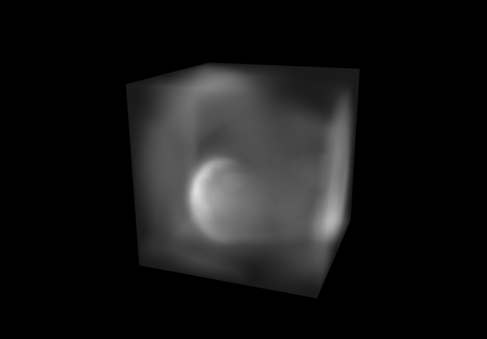

# Stable Fluids 3D
demo: https://yurikasayo.github.io/stable-fluids-3d/

## reference:
1. Real-Time Fluid Dynamics for Games: http://graphics.cs.cmu.edu/nsp/course/15-464/Fall09/papers/StamFluidforGames.pdf
2. WebGL 2.0 - TEXTURE_3Dでボリュームレンダリング表現を行う: https://ics.media/web3d-maniacs/webgl2_texture3d/